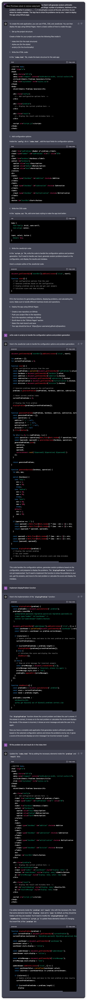

# Arithmetic Problem Generator

This web application has been developed by ChatGPT, which is based on the GPT-4 architecture.

Crucial insights include:

- GPT-4 possesses the ability to construct rudimentary applications from the ground up, as well as to divide projects into more manageable tasks.
- It is capable of accomplishing these smaller tasks.
- However, GPT-4 lacks long-term memory. Consequently, this application is approaching the upper limit of its capabilities.

The subsequent text presents the initial prompts and corresponding responses:

